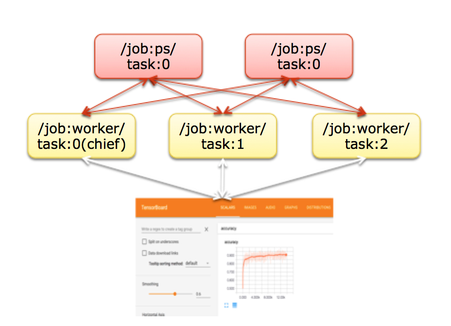

# Distributed Machine Learning with Tensorflow and Kubernete

This project contains Helm Chart whcih orignally was published at official website of Helm platform. [link](https://hub.helm.sh/charts/stable/distributed-tensorflow)
In this separated repository is located also additional instruction and configuration files for educational purposes of Warsaw University of Technology.

## Idea

Idea of this project is made up from 3 elements.
First of them is a container with Python script implementing distributed architecture of Tensorflow library.
This architecture is build with 2 unit types - *ps* and *worker*.
*ps* unit is a *Parameter Server* and it's task is to maintain valuesof neural net that are updated during learning process and spliting of neural net model so that multiple units could analyze and teach it in parrarel.
*worker* unit is proper teaching unit and make learning process happen based on data received from *ps* units.
Second element is deployment of distributed machine learning architecture into Kubernetes platform.
Kubernetes platform is more and more popular in commercial use and for sure everyone on us use it daily - using banking system (PayPal, ING) or online gaming (Leag of Legends, Fortnite).
It's puropose is to connect mutiple machines into cluster  as high available platform for containerized applications deployment.
In case of this project deployment is build with two sets of containers - containers working as *ps* units and containers working as *worker* units.
Third element is packaging of manifests (configuration files of deployment) for Kubernetes platform in a way that whole deployment is nice and easy for operator.
For this purpose is Helm platform used which generates manifest dynamically based on configuration passed in *values.yml* file.



## Installation step by step

### Prerequisities

Before installation you'll need few tools:

- [] **Docker** - It's containerizing tool. One of thw most popular for personal computers (for commercial use more popular is containerd or CRI-O which is a bit harder to use). Installing Docker on MacOS or Windows you install in fact virtual machine of Linux with Docker so for this project Linux Operating System is hardly recommended. [Install instructions](https://docs.docker.com/get-docker/)
- [] **Kind** (Kubernetes in Docker) - It's a friendly tool which creates few containers on single machine and afterwards installs at top of them Kubernetes platform. So that way with only single computer we're able to simulate multi-node cluster. [Install instructions](https://kind.sigs.k8s.io/docs/user/quick-start/)
- [] **kubectl** - This is CLI tool which allows to interact with Kubernetes cluster. [Install instructions](https://kubernetes.io/docs/tasks/tools/install-kubectl/)
- [] **Helm** - To install final package with project we'll need Helm CLI tool. [Install instructions](https://helm.sh/docs/intro/install/)

### Preparing the environment

In the first step we'll need to prepare the environment. Here it's Kubernetes platform run at top of simulated machines in containers made with Kind tool.

In project repository you'll find *kind-config.yml* which contains configuration of the cluster.
```
kind: Cluster
apiVersion: kind.x-k8s.io/v1alpha4
nodes:
- role: control-plane
- role: worker
- role: worker
- role: worker
```
Above configuration defines that cluster has 1 master node (which controls the whole cluster - it's possible to have more than one master node, but here we'll use just one node) and 3 worker nodes.

To create cluster run this command: `kind create cluster --config kind-config.yml`

If everything works properly this should be the output at the screen"
```
$ kind create cluster --config kind-config.yml
Creating cluster "kind" ...
 ✓ Ensuring node image (kindest/node:v1.18.2) 🖼
 ✓ Preparing nodes 📦 📦 📦 📦
 ✓ Writing configuration 📜
 ✓ Starting control-plane 🕹️
 ✓ Installing CNI 🔌
 ✓ Installing StorageClass 💾
 ✓ Joining worker nodes 🚜
Set kubectl context to "kind-kind"
You can now use your cluster with:

kubectl cluster-info --context kind-kind

Not sure what to do next? 😅  Check out https://kind.sigs.k8s.io/docs/user/quick-start/
```

### Configuration of project parameters

Project configuration is made with *values.yml* file which is interpreted by Helm platform.

Example file looks like that:
```
# Default values for distributed-tensorflow.
# This is a YAML-formatted file.
# Declare variables to be passed into your templates.
worker:
  number: 2 # Number of worker units that's supposed to run in our cluster
  podManagementPolicy: Parallel # It's a specific field for StatefulSet resource which defines that containers should start in parrarel (by default it starts one by one)
  image: # This section describes details of container image
    repository: dysproz/distributed-tf # Repository and name of the container image
    tag: 1.7.0 # Container version tag
    pullPolicy: IfNotPresent # Policy that defines that image will be donwloaded only if there's no such image locally
  port: 9000 # Port number used by Python script (it has to be modified in script as well)
  limit: # This section defines resource limits for single container
    memory: 125Mi
    cpu: 200m
ps: # Similar configuration as for worker unit
  number: 2
  podManagementPolicy: Parallel
  image:
    repository: dysproz/distributed-tf
    tag: 1.7.0
    pullPolicy: IfNotPresent
  port: 8000
  limit:
    memory: 125Mi
    cpu: 200m
# optimize for training
hyperparams: # This section defines parameters of learning process
  batchsize: 20 # Single batch size
  learningrate: 0.001 # Level of learning rate - used usually to limit changes of neural net parameters
  trainsteps: 200 # Number of learning steps. 0 value defines infinite learning
volumes: # This section defines volumes defined due to k8s standard notation..
  - name: logs-volume
    hostPath:
      path: /tmp/mnist # This drive is defined as host path on local machine.
volumeMounts: # This section defines mount of volumes to containers
  - name: logs-volume
    mountPath: /tmp/mnist-log # This definition defines that previously defined drive will be mounted into container undet /tmo/mnist-log path
```

Implementation details of the script in container may be found [here](https://github.com/Dysproz/distributed-tensorflow).

### Installation of project with Helm platform

With ready project configuration we may install it with command `helm install mnist distributed-tensorflow-chart/ --values values.yml`.

Proper installation should return output similar to this:
```
$ helm install mnist distributed-tensorflow-chart/ --values values.yaml
NAME: mnist
LAST DEPLOYED: Sun Sep 13 11:56:55 2020
NAMESPACE: default
STATUS: deployed
REVISION: 1
TEST SUITE: None
NOTES:
1. Get the application Status by running these commands:

  echo "Get the statefulset of distributed tensorflow"
  kubectl get sts --namespace default -l "app=distributed-tensorflow,release=mnist"
```

### Observing the project

The project works and we may observe it.

First element to check is state of StatefulSet resource with command `kubectl get sts`
```
$ kubectl get sts
NAME           READY   AGE
mnist-ps       0/2     2m28s
mnist-worker   0/2     2m28s
```

As we may see here, two sets of Pods - the smaller unit in Kubernetes platform which contains one or more containers.
Status also points that in both sets 0 out of 2 Pod's are ready.

It may be surprising as none of the containers started so wemay check details with `kubectl get pod`
```
$ kubectl get po
NAME             READY   STATUS              RESTARTS   AGE
mnist-ps-0       0/1     ContainerCreating   0          2m15s
mnist-ps-1       0/1     ContainerCreating   0          2m15s
mnist-worker-0   0/1     ContainerCreating   0          2m15s
mnist-worker-1   0/1     ContainerCreating   0          2m15s
```
Here we see all Pods on the cluster.
As we can see each of them have *ContainerCreating* state which means that there's no error and containers are just starting (probably downloading image first).

After few minutes we may again check statuses:
```
$ kubectl get po
NAME             READY   STATUS    RESTARTS   AGE
mnist-ps-0       1/1     Running   0          7m3s
mnist-ps-1       1/1     Running   0          7m3s
mnist-worker-0   1/1     Running   0          7m3s
mnist-worker-1   1/1     Running   0          7m3s
```
And now all containers are *Running*.
Just to make sure let's check StatefulSet:
```
$ kubectl get sts
NAME           READY   AGE
mnist-ps       2/2     7m50s
mnist-worker   2/2     7m50s
```
And now both sets have 2 out of 2 Pods ready.
It means that our project works properly.

If we want to check current learning process status we may run command in one of *ps* unit containers.
Command `kubectl exec -it mnist-ps-1 -- tail -f /tmp/mnist-log/deploy.log` will show logs in real time.
```
$ kubectl exec -it mnist-ps-1 -- tail -f /tmp/mnist-log/deploy.log
2020-09-13 10:07:34,373 - __main__ - INFO - 1599991654.373432: Worker 0: training step 132 done (global step: 198)
INFO:__main__:1599991654.373432: Worker 0: training step 132 done (global step: 198)
2020-09-13 10:07:34,434 - __main__ - INFO - 1599991654.434183: Worker 0: training step 133 done (global step: 199)
INFO:__main__:1599991654.434183: Worker 0: training step 133 done (global step: 199)
2020-09-13 10:07:34,495 - __main__ - INFO - 1599991654.495170: Worker 0: training step 134 done (global step: 200)
INFO:__main__:1599991654.495170: Worker 0: training step 134 done (global step: 200)
2020-09-13 10:07:34,495 - __main__ - INFO - Training ends @ 1599991654.495587
INFO:__main__:Training ends @ 1599991654.495587
2020-09-13 10:07:34,495 - __main__ - INFO - Training elapsed time: 58.030548 s
INFO:__main__:Training elapsed time: 58.030548 s
```
Above logs show end of learning process.
We may see last few learning steps and final message.
It's worth noticing that for learing steps there are local ang global steps.
Local steps are for this single container and global steps are for whole neural net model.
Final message shows total learning time in seconds.

It's worth noticing that currently end of the learning process restarts the learning process - it's because of StatefulSet resource use which has Pods that expect container to run contiously and end of the process means that there's and error and it has to be restarted.
Better implementation would be to use Job resource which end of the process with exit status 0 see as success, but currently StatefulSet is used, because of it's networking factors.

To prevent missing logs here are used mounted volumes. Even after restart of the container logs may be found at the host machine (here in Kind container).

To see logs on the host first we'll need to spot the right node.
```
$ kubectl get po -o wide
NAME             READY   STATUS    RESTARTS   AGE   IP           NODE           NOMINATED NODE   READINESS GATES
mnist-ps-0       1/1     Running   0          21m   10.244.3.2   kind-worker3   <none>           <none>
mnist-ps-1       1/1     Running   0          21m   10.244.2.3   kind-worker    <none>           <none>
mnist-worker-0   1/1     Running   5          21m   10.244.2.2   kind-worker    <none>           <none>
mnist-worker-1   1/1     Running   5          21m   10.244.1.2   kind-worker2   <none>           <none>
```
From above output we see that *mnist-ps-1* Pod runs on *kind-worker* node.

With this information we may execute shell into this Kind container with `docker exec -it kind-worker sh`.

Afterwards all logs are under */tmo/mnist/deploy.log* file.

### Uninstalling

To uninstall project from the cluster run command `helm uninstall mnist`.

Afterwards, if we don't need Kubernetes platform anymore then we may delete it with `kind delete cluster`.
